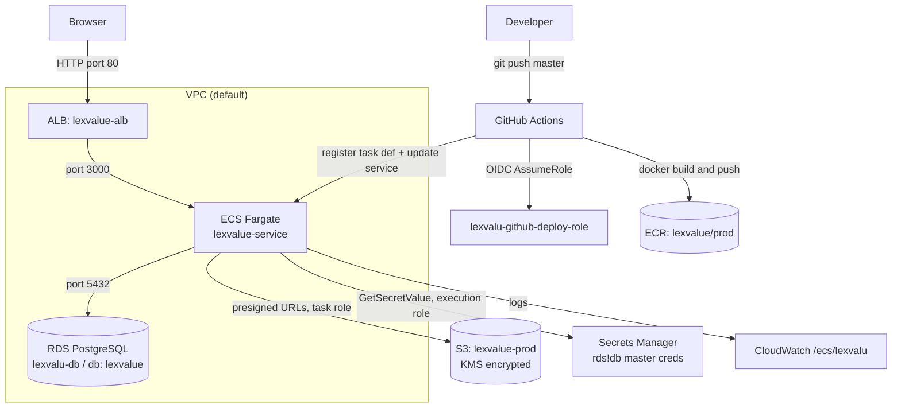

# LexValu.ai — Infrastructure & Deployment

This document describes how LexValu.ai is deployed and how the AWS infrastructure
fits together. It is the source of truth for any developer working on deployment,
CI/CD, or cloud resources.

> **HIPAA note:** This app handles PHI. Never commit secret *values*, never log
> PHI/PII, and always keep `firmId` isolation on every query. See `AGENTS.md`.

---

## 1. High-level architecture



**Stack:** Next.js 16 (App Router, standalone build) · Prisma 7 (pg driver adapter) ·
PostgreSQL on RDS · S3 for documents · ECS Fargate · Application Load Balancer.

---

## 2. AWS account & global settings

| Item | Value |
|---|---|
| AWS Account ID | `445606684295` |
| Region | `us-east-1` |
| VPC | default VPC |

---

## 3. Container image (ECR)

| Item | Value |
|---|---|
| Repository | `lexvalue/prod` |
| URI | `445606684295.dkr.ecr.us-east-1.amazonaws.com/lexvalue/prod` |
| Settings | Private · Tag immutability ON · Scan on push ON · KMS encryption |
| Image tag scheme | Git commit SHA (`${{ github.sha }}`), set by CI |

The image is built from the repo `Dockerfile` (multi-stage, Debian-slim, non-root
user `nextjs`). It contains the Next.js standalone server **and** the full
`node_modules` so the Prisma CLI can run `db push` at startup.

---

## 4. Compute (ECS Fargate)

| Item | Value |
|---|---|
| Cluster | `lexvalue-cluster` |
| Service | `lexvalue-service` (desired count: 1) |
| Task definition family | `lexvalu-task` (see `task-definition.json`) |
| Launch type | Fargate |
| CPU / Memory | 0.5 vCPU / 1 GB (`512` / `1024`) |
| Container name | `lexvalu` |
| Container port | `3000` |
| Public IP | Enabled |
| Logs | CloudWatch group `/ecs/lexvalu` (auto-created) |

The canonical task definition lives in **`task-definition.json`** at the repo root.
CI renders it with the freshly-built image tag and registers a new revision on
every deploy.

### Container startup sequence (`docker-entrypoint.sh`)
1. If `DATABASE_URL` is not set, build it from the injected `DB_*` vars (URL-encoded, `sslmode=no-verify`).
2. Run `prisma db push` to sync the schema to RDS (runs **inside the VPC**, reaches private RDS — no public exposure).
3. `exec node server.js` to start Next.js.

---

## 5. Database (RDS PostgreSQL)

| Item | Value |
|---|---|
| Instance identifier | `lexvalu-db` |
| Endpoint | `lax-value.c0lsgcoogql1.us-east-1.rds.amazonaws.com:5432` |
| Database name | `lexvalue` |
| Public access | **No** (private) |
| Storage encryption | Enabled |
| Credentials | **Managed by AWS in Secrets Manager** (auto-rotating) |
| Managed secret | `rds!db-c4ed7f99-3774-4d72-9a01-8f7db7211454` |

### How the app gets DB credentials
The RDS master credentials are owned/rotated by AWS in the `rds!db-...` secret.
The ECS task pulls the `username` and `password` **fields** from that secret
(via the `:username::` / `:password::` ARN suffix) as `DB_USERNAME` / `DB_PASSWORD`.
Host/port/name come from plain env (`DB_HOST`, `DB_PORT`, `DB_NAME`).

`src/lib/prisma.ts` assembles the connection string at runtime from these parts,
so **automatic password rotation is picked up on each new task start** — no
hand-copied connection string to keep in sync.

### Schema management
The app uses **`prisma db push`** (no migration files). The container runs it on
startup (see §4). Schema is defined in `prisma/schema.prisma`; the datasource URL
for the CLI is resolved in `prisma.config.ts` from `process.env.DATABASE_URL`.

---

## 6. File storage (S3)

| Item | Value |
|---|---|
| Bucket | `lexvalue-prod` |
| Public access | Fully blocked |
| Encryption | SSE-KMS (bucket key enabled) |
| Versioning | Enabled |
| CORS | `PUT`/`GET` from app origin (tighten to the real domain) |

Access is via the **ECS task role** (no static keys). `src/lib/s3.ts` creates the
S3 client with no credentials, so the AWS SDK uses the task role automatically.
Uploads/downloads use short-lived (5 min) presigned URLs; uploads enforce
`ServerSideEncryption: aws:kms`.

---

## 7. Secrets Manager

| Secret | Purpose | Status |
|---|---|---|
| `rds!db-c4ed7f99-...` | RDS master username/password | **Active** (AWS-managed) |
| `lexvalu/JWT_SECRET` | JWT session signing key | **NOT created yet** — see TODO |
| `lexvalu/LAMBDA_API_KEY` | Auth for the AWS Lambda webhook | **NOT created yet** — see TODO |

> ⚠️ `JWT_SECRET` and `LAMBDA_API_KEY` are currently **not** injected. The app
> therefore falls back to the hardcoded default in `src/lib/auth.ts`, which is a
> **security hole** (anyone could forge sessions). This must be fixed before real
> users / PHI — see §12 TODO. To add them: create the two secrets, then re-add the
> corresponding lines to the `secrets` array in `task-definition.json`.

**Tip:** Multiple app secrets can live in ONE JSON secret (e.g. `lexvalu/app`) and
be referenced per-key with the `:KEY::` ARN suffix — cheaper than one secret each.

---

## 8. IAM roles

| Role | Trusted by | Permissions |
|---|---|---|
| `lexvalu-ecs-execution-role` | ECS tasks | `AmazonECSTaskExecutionRolePolicy` + inline `lexvalu-read-secrets` (`secretsmanager:GetSecretValue` on `lexvalu/*` and `rds!db-*`) |
| `lexvalu-ecs-task-role` | ECS tasks (running app) | inline `lexvalu-app-s3`: `s3:PutObject`/`GetObject` on `lexvalue-prod/*` + `kms:GenerateDataKey`/`Decrypt` |
| `lexvalu-github-deploy-role` | GitHub Actions (OIDC) | ECR push, ECS update/register, `iam:PassRole` on the two ECS roles |

- **Execution role** = what ECS uses to *start* the task (pull image, read secrets).
- **Task role** = what the *running app* can do (S3).

---

## 9. CI/CD — push-to-deploy (GitHub OIDC)

**File:** `.github/workflows/deploy.yml` · **Trigger:** push to `master`.

```
git push master
  → GitHub Actions assumes lexvalu-github-deploy-role via OIDC (no stored keys)
  → docker build + push image to ECR (tagged with commit SHA)
  → render task-definition.json with the new image
  → register new task def revision + update lexvalue-service
  → ECS rolls out the new task (which runs `prisma db push` then starts)
```

### OIDC trust (important detail)
This GitHub org injects **immutable numeric IDs** into the OIDC subject claim, so
the `sub` is **not** the standard format. The deploy role's trust policy matches
the real subject:

```
repo:lexvalueai@306630996/LexValu.ai@1307888482:ref:refs/heads/master
```

- OIDC provider: `token.actions.githubusercontent.com`
- Audience: `sts.amazonaws.com`
- The deploy role ARN is hardcoded in the workflow (`role-to-assume`). It is not a
  secret; the trust policy restricts who can assume it.

If OIDC ever fails with `Not authorized to perform sts:AssumeRoleWithWebIdentity`,
the `sub` in the trust policy no longer matches — re-derive it (a temporary debug
step that prints the token `sub`/`aud` is the fastest way).

---

## 10. Networking & security groups

Load balancer and ECS tasks currently **share one security group**:
`lexvalu-app-sg` = `sg-0488468099ff9bd94`.

| SG | Inbound rules |
|---|---|
| `lexvalu-app-sg` (`sg-0488468099ff9bd94`) | `80` from `0.0.0.0/0` (public → ALB); `3000` from itself (ALB → container) |
| `lexvalu-rds-sg` | `5432` from `lexvalu-app-sg` (app → DB only) |

| Load balancer | Value |
|---|---|
| ALB | `lexvalue-alb` |
| Listener | HTTP `:80` (⚠️ no HTTPS yet — see TODO) |
| Target group | `lexvalue-tg` (HTTP, target port 3000) |
| Health check | Path `/`, **success codes `200-399`** (the app 307-redirects `/` → `/login`, so plain `200` would read unhealthy) |

---

## 11. Repo files that shape the infrastructure

| File | Role |
|---|---|
| `Dockerfile` | Multi-stage build; bundles standalone app + full `node_modules` (for Prisma CLI); non-root |
| `docker-entrypoint.sh` | Runs `prisma db push`, then starts the server |
| `.dockerignore` | Keeps `.env*`, keys, git out of the image |
| `task-definition.json` | ECS task spec (env, secrets, roles, logs) |
| `.github/workflows/deploy.yml` | Push-to-`master` pipeline |
| `next.config.ts` | `output: "standalone"` |
| `prisma.config.ts` | Resolves datasource URL from `DATABASE_URL` |
| `src/lib/prisma.ts` | Builds connection string from `DB_*` (rotation-safe) |
| `src/lib/s3.ts` | S3 client with no static keys (uses task role) |

### Runtime environment variables

| Var | Source | Notes |
|---|---|---|
| `NODE_ENV` | task def env | `production` |
| `AWS_REGION` | task def env | `us-east-1` |
| `AWS_S3_BUCKET_NAME` | task def env | `lexvalue-prod` |
| `DB_HOST` / `DB_PORT` / `DB_NAME` | task def env | RDS endpoint / `5432` / `lexvalue` |
| `DB_USERNAME` / `DB_PASSWORD` | secret (`rds!db-...`) | pulled per-field |
| `DATABASE_URL` | assembled at runtime | not set directly in prod |
| `JWT_SECRET` / `LAMBDA_API_KEY` | (pending) Secrets Manager | see §7 / TODO |

---

## 12. Open items / TODO (before production PHI)

- [ ] **HTTPS (critical for HIPAA):** add an ACM certificate + `:443` listener on the
      ALB and a domain; redirect `:80` → `:443`. Traffic is currently plain HTTP.
- [ ] **`JWT_SECRET` in Secrets Manager (critical):** create it and re-add to the task
      def so login stops using the hardcoded fallback in `src/lib/auth.ts`.
- [ ] **`LAMBDA_API_KEY`:** create + wire when the document-processing Lambda is built.
- [ ] **Tighten S3 CORS** `AllowedOrigins` to the real app domain (not `*`).
- [ ] **Separate ALB and task security groups** (currently shared) for tighter scoping.
- [ ] **RDS Multi-AZ** for production HA (currently single instance).
- [ ] **Consider real Prisma migrations** instead of `db push` once schema stabilizes.
- [ ] **DB SSL:** currently `sslmode=no-verify` (encrypted, no CA check). For full
      verification, bundle the RDS CA and switch to `verify-full`.

---

## 13. Common operations

**Deploy:** just `git push origin master`. Watch GitHub → Actions, then ECS →
`lexvalue-service` → Tasks.

**View app logs:** CloudWatch → Log groups → `/ecs/lexvalu` (or the task's Logs tab).

**Restart / force redeploy:** ECS → `lexvalue-service` → Update service → check
**Force new deployment**.

**Roll back:** ECS → task definition `lexvalu-task` → select a previous revision →
update the service to it. (Images are retained in ECR by commit SHA.)

**Local development:** uses the local Postgres URL fallback in `prisma.config.ts`
and `src/lib/prisma.ts` (`DATABASE_URL` unset → localhost dev DB).
